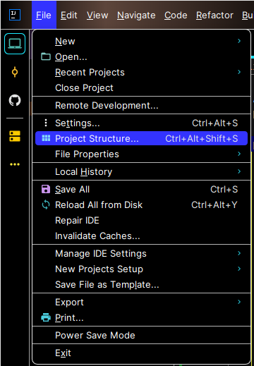
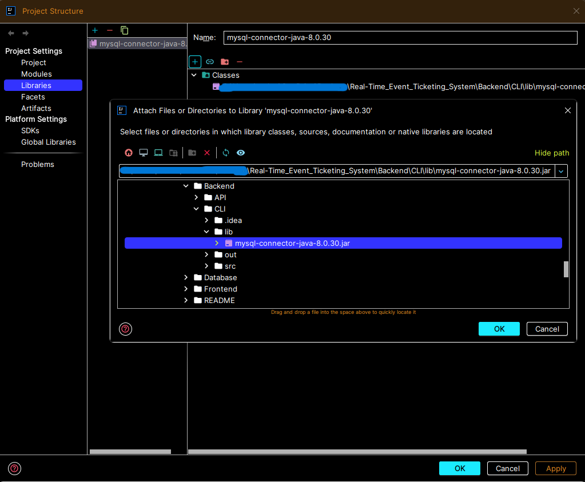

# Real-Time Event Ticketing System

## CLI Setup and Test in locally
* If you are setting up this project on IntelliJ you should set up it by adding mysql-connector-java-8.0.30.jar to the project
* File -> Project Structure -> Libraries -> + (button) -> [Select mysql-connector-java-8.0.30.jar jar that locaded in Backend/CLI/lib/mysql-connector-java-8.0.30.jar ] -> ok (button) -> ok (button)

